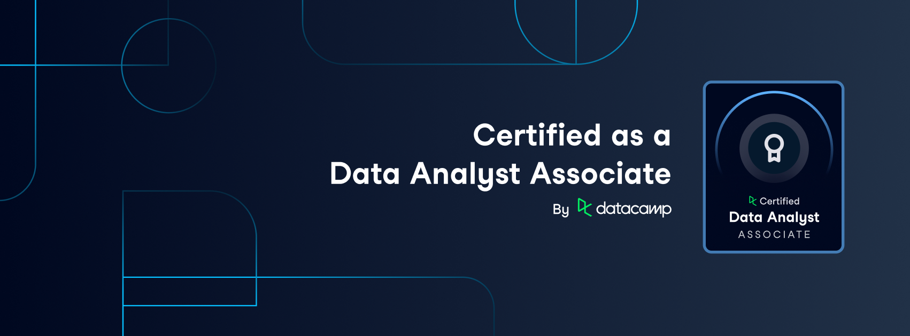
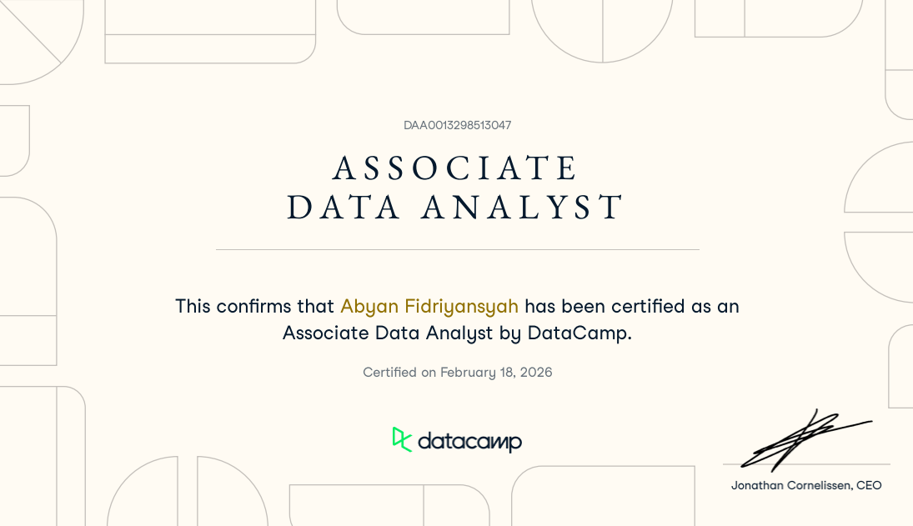
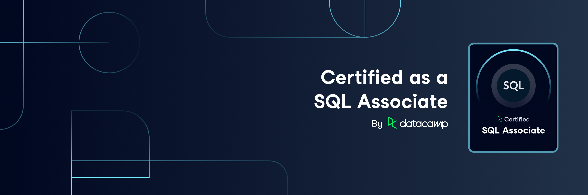
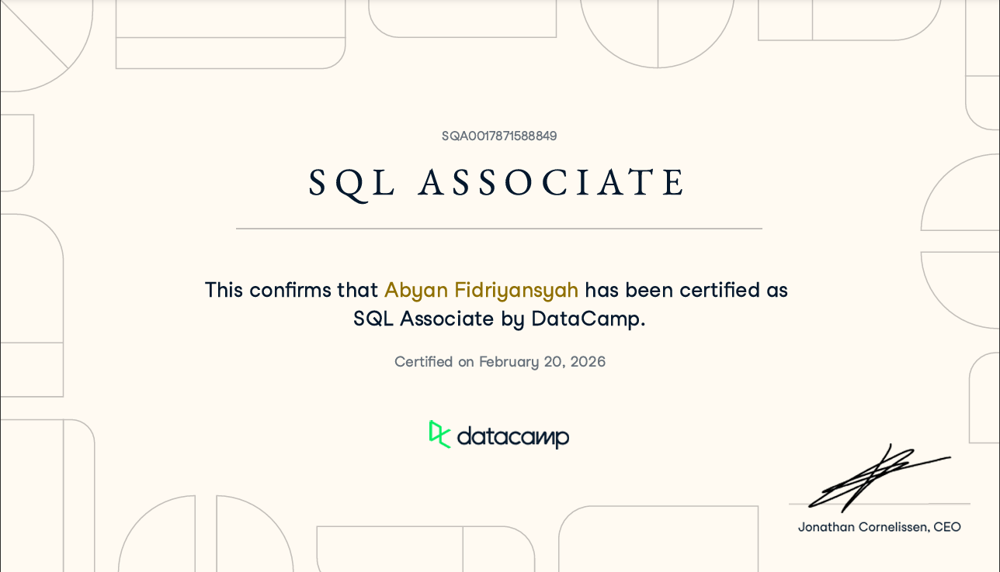
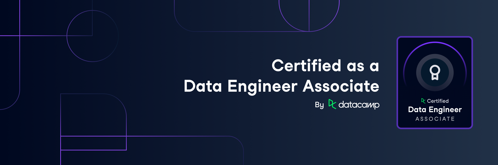
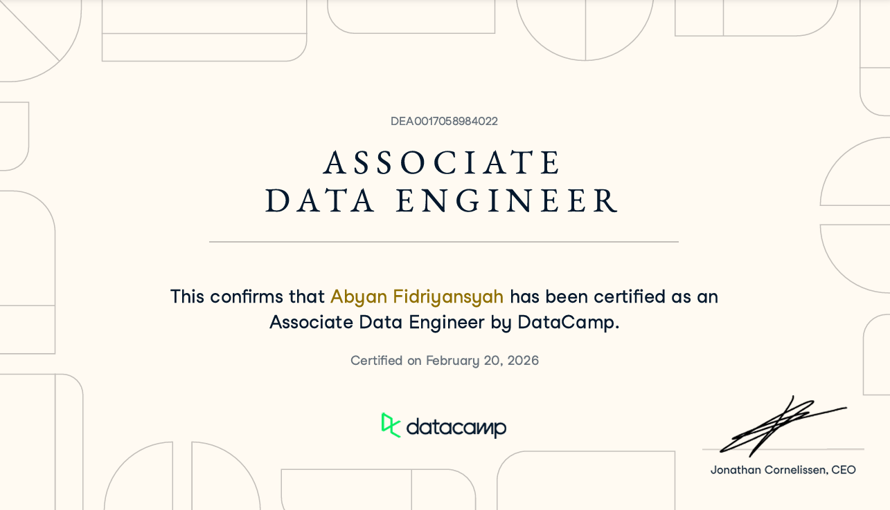

# DataCamp Certification Portfolio

This repository contains my submissions for **DataCamp Practical Exams** and certification projects. Each folder represents a completed certification with real-world case studies, demonstrating proficiency in data analysis, SQL, and analytical problem-solving.

---

## Certifications

### 1. DataCamp Associate Data Analyst (DA601P)



**Completed:** February 18, 2026  
**Duration:** 1-2 hours  
**Focus:** SQL proficiency for real-world data analysis

#### Case Study: FoodYum Grocery Store

FoodYum is a grocery store chain based in the United States, selling produce, meat, dairy, baked goods, snacks, and other household food staples. As food costs rise, the company aims to maintain product diversity across all price ranges to serve a broad customer base.

#### Timed Exam: DA101

The timed exam (DA101) assesses your proficiency in data management, exploratory analysis, and statistical experimentation using SQL. To successfully pass this exam, you should be able to:

- Perform data extraction, joining and aggregation tasks
- Perform cleaning tasks to prepare data for analysis
- Assess data quality and perform validation tasks
- Calculate metrics to effectively report characteristics of data and relationships between features
- Read, and analyze data visualizations to represent the relationships between features
- Describe statistical concepts that underpin hypothesis testing and experimentation

**Skills Demonstrated:**

- SQL query optimization
- Data analysis and reporting
- Price range analysis
- Inventory management insights

[View Project](./DA601P/)



---

### 2. DataCamp Associate SQL Certification (SQ501P-SQ101)



**Completed:** February 20, 2026  
**Duration:** 1 hour  
**Focus:** Advanced SQL for business operations analysis

#### Case Study: LuxurStay Hotels

LuxurStay Hotels is a major international chain serving both business and leisure travelers. The management has been addressing complaints about slow room service affecting customer satisfaction, which has dropped from the expected 4.5 rating. The project involves working with the Head of Operations to identify root causes and problematic hotel branches.

#### Timed Exam: SQ101

The timed exam (SQ101) assesses your proficiency in data management theory, data management in SQL, and exploratory analysis using SQL. To successfully pass this exam, you should be able to:

- Calculate metrics to effectively report characteristics of data and relationships between features using PostgreSQL
- Interpret a database schema and explain database design concepts (such as normalization, design, schemas, data storage options)
- Assess data quality and perform validation tasks
- Perform cleaning tasks to prepare data for analysis
- Perform data extraction, joining and aggregation tasks

**Skills Demonstrated:**

- Complex SQL queries
- Operations analysis
- Customer satisfaction metrics
- Root cause identification
- Performance benchmarking

[View Project](./SQ501P-SQ101/)



---

### 3. DataCamp Associate Data Engineer (DE501P)



**Completed:** February 21, 2026  
**Duration:** 1 hour  
**Focus:** Data cleaning and validation for analytics

#### Case Study: EasyLoan

EasyLoan offers a wide range of loan services, including personal loans, car loans, and mortgages. The company serves clients from Canada, United Kingdom, and United States. The analytics team wants to report performance across different geographic areas to identify areas of strength and weakness for the business strategy team. This project ensures the data is accessible and reliable before reporting begins.

#### Timed Exam: DE101

The timed exam (DE101) assesses your proficiency in data management, data cleaning, and SQL for data engineering tasks. To successfully pass this exam, you should be able to:

- Interpret a database schema and explain database design concepts (such as normalization, design, schemas, data storage options)
- Identify different cloud tools that can be used for storing data and creating and maintaining data pipelines
- Perform data extraction, joining and aggregation tasks
- Perform cleaning tasks to prepare data for analysis
- Assess data quality and perform validation tasks
- Use data visualization tools to demonstrate characteristics of data
- Read and analyze data visualizations to represent the relationships between features

**Skills Demonstrated:**

- Data cleaning and validation
- SQL data transformation
- Missing value imputation
- Multi-table joins
- Data quality assessment

[View Project](./DE501P/)



---

## Repository Structure

```
datacamp/
├── DA601P/                 # Associate Data Analyst Certification
│   ├── solution.ipynb      # SQL queries and analysis
│   ├── exported/           # Query result exports
│   ├── banner.png
│   ├── certificate.png
│   └── README.md
│
├── DE501P/                 # Associate Data Engineer Certification
│   ├── solution.ipynb      # SQL queries and analysis
│   ├── exported/           # Query result exports
│   ├── banner.png
│   ├── certificate.png
│   └── README.md
│
├── SQ501P-SQ101/          # Associate SQL Certification
│   ├── solution.ipynb      # SQL queries and analysis
│   ├── exported/           # Query result exports
│   ├── banner.png
│   ├── certificate.png
│   └── README.md
│
└── README.md              # This file
```

---

## Purpose

This repository serves as:

- **Portfolio of Work:** Demonstrating practical data analysis skills through industry-recognized certifications
- **Reference Material:** Solutions to real-world business problems using SQL and data analysis
- **Learning Documentation:** Tracking progress and achievements in data analytics

---

All certifications are earned through **DataCamp's industry-recognized professional certification program**, which validates practical skills through timed, real-world case study challenges.

---

_Last Updated: February 21, 2026_
